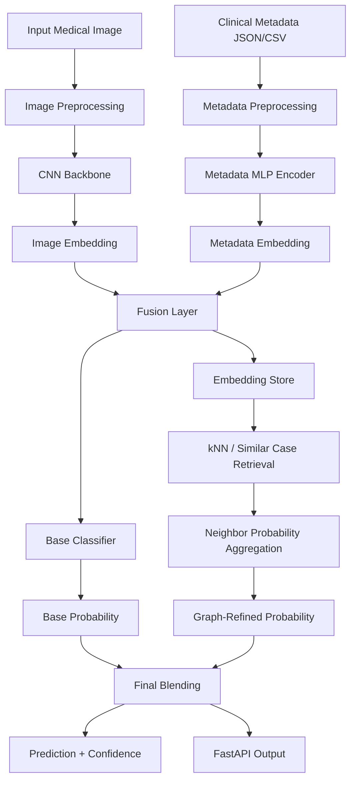

# Architecture Graph

## Explanation

- **CNN Backbone** extracts image features.
- **Metadata Encoder** converts structured clinical fields into a dense embedding.
- **Fusion Layer** combines image and metadata signals.
- **Base Classifier** produces the primary prediction.
- **kNN / Similar Case Retrieval** approximates graph reasoning using nearest-neighbor evidence.
- **Final Blending** combines the base model and graph-refined evidence.

## Interview one-liner

> "This architecture progresses from image understanding to multimodal fusion and then to graph-inspired case retrieval for more clinically realistic decision support."
