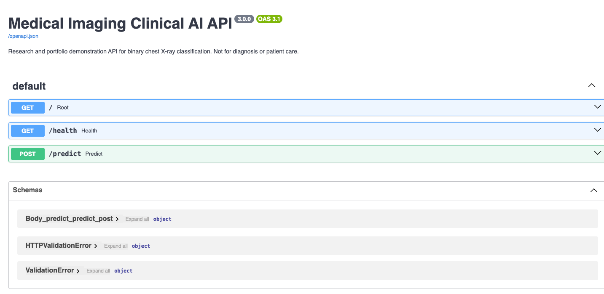
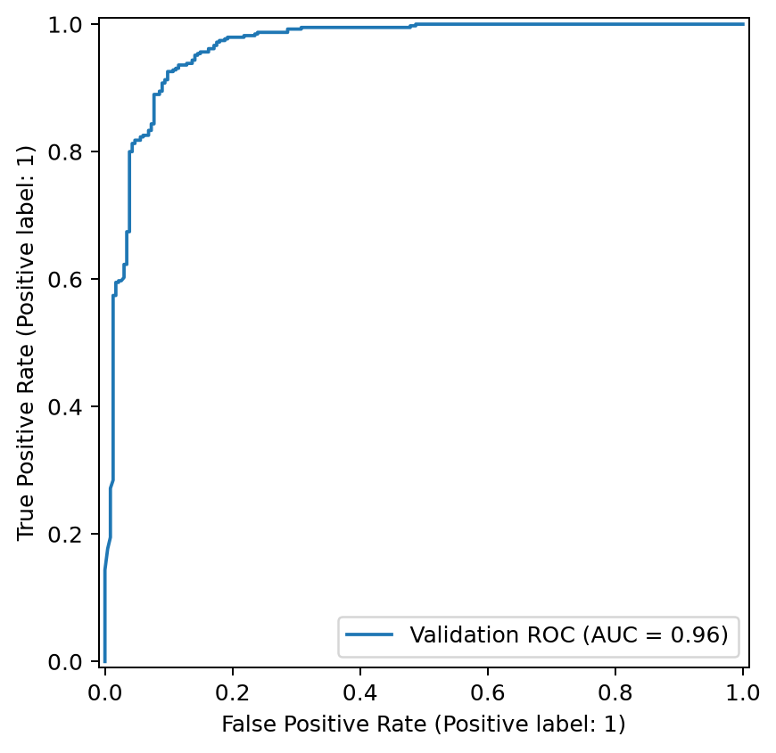
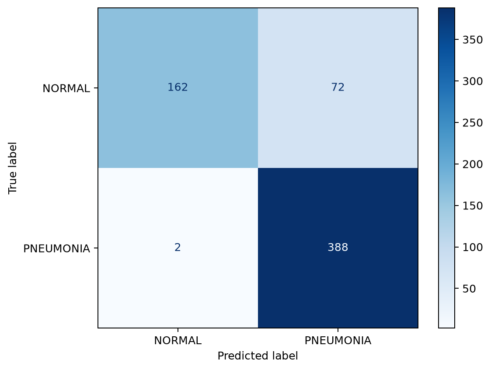

# 🩻 Medical Imaging Clinical AI

> **End-to-End Deep Learning, Medical Imaging AI, and Deployment
> Portfolio**


------------------------------------------------------------------------

## Overview

This repository demonstrates an end-to-end medical imaging AI workflow
for binary chest X-ray classification using modern deep learning and
deployment practices.

### Highlights

-   End-to-end imaging pipeline
-   EfficientNet-B0 transfer learning
-   ResNet18 / ResNet50 / EfficientNet-V2-S support
-   Model evaluation and explainability
-   FastAPI inference API
-   Streamlit clinical review application
-   Apple Silicon (MPS), CUDA and CPU support

> **Research & Portfolio Project**
>
> This project is intended for software engineering and machine learning
> portfolio purposes only. It is **not** intended for diagnosis,
> treatment, or clinical decision making.

------------------------------------------------------------------------

# 📷 Application Preview

Create the folder:

``` text
docs/images/
```

Place screenshots:

``` text
streamlit_home.png
fastapi_docs.png
roc_curve.png
confusion_matrix.png
gradcam.png
architecture.png
```

### Streamlit Application


### FastAPI Swagger UI



------------------------------------------------------------------------

# 📈 Validation Results

  Metric                              Result
  --------------------- --------------------
  Model                      EfficientNet-B0
  Validation ROC AUC              **0.9636**
  Validation Accuracy             **88.14%**
  Validation F1 Score             **0.9129**
  Classes                 NORMAL / PNEUMONIA

### ROC Curve



### Confusion Matrix



------------------------------------------------------------------------

# 🏗️ System Architecture

``` text
Medical Images
      │
      ▼
Bronze Layer
      │
      ▼
Silver Layer
      │
      ▼
Gold Feature Layer
      │
      ▼
EfficientNet-B0
      │
      ▼
Evaluation
 ├── ROC Curve
 ├── Confusion Matrix
 ├── Classification Report
 └── Grad-CAM
      │
      ▼
FastAPI
      │
      ▼
Streamlit
```

------------------------------------------------------------------------

# 📁 Repository Structure

``` text
api/
app/
artifacts/
docs/
evaluation/
graph/
models/
notebooks/
outputs/
preprocessing/
src/
tests/
README.md
```

------------------------------------------------------------------------

# ✨ Features

-   EfficientNet-B0 transfer learning
-   ResNet18 / ResNet50 / EfficientNet-V2-S
-   FastAPI REST API
-   Streamlit dashboard
-   ROC, PR Curve and Confusion Matrix
-   Grad-CAM visualization
-   Checkpoint management
-   Apple Silicon (MPS), CUDA and CPU support
-   Docker-ready project layout
-   GitHub-ready documentation

------------------------------------------------------------------------

# 🚀 Quick Start

## Installation

``` bash
python -m venv .venv
source .venv/bin/activate

pip install -r requirements.txt
```

## Train

``` bash
python -m src.train_cnn \
    --architecture efficientnet_b0 \
    --epochs 5
```

## Run FastAPI

``` bash
uvicorn api.main:app --reload
```

Open:

``` text
http://127.0.0.1:8000/docs
```

## Run Streamlit

``` bash
streamlit run app/streamlit_app.py
```

------------------------------------------------------------------------

# 📊 Generated Outputs

``` text
models/checkpoints/efficientnet_b0/

best_model.pt
latest_checkpoint.pt
best_metrics.json
run_summary.json
training_history.json
classification_report.json
roc_curve.png
confusion_matrix.png
```

------------------------------------------------------------------------

# 🛠️ Technology Stack

-   Python
-   PyTorch
-   Torchvision
-   FastAPI
-   Streamlit
-   Scikit-learn
-   NumPy
-   Pandas
-   Matplotlib

------------------------------------------------------------------------

# 📚 Additional Documentation

The repository also contains supporting documents describing the design
and evolution of the project.

-   `GRAPH_README.md` --- graph-enhanced clinical reasoning concept
-   `PROJECT_COMPLETENESS_NOTES.md` --- project organization and
    included components
-   `UPGRADE_SUMMARY.md` --- feature additions and validation summary
-   `FINAL_CHECK.md` --- validation checklist

------------------------------------------------------------------------

# 🎯 Portfolio Skills Demonstrated

-   Machine Learning
-   Deep Learning
-   Medical Imaging
-   Computer Vision
-   Explainable AI
-   Model Evaluation
-   REST API Development
-   Interactive Web Applications
-   End-to-End ML Engineering
-   Software Engineering

------------------------------------------------------------------------

# ⚠️ Disclaimer

This repository is intended for:

-   Education
-   Research
-   Portfolio demonstration

It is **not**:

-   FDA approved
-   Clinically validated
-   Intended for diagnosis or patient care

Clinical decisions should always involve qualified healthcare
professionals.

------------------------------------------------------------------------

# 📄 License

MIT License
