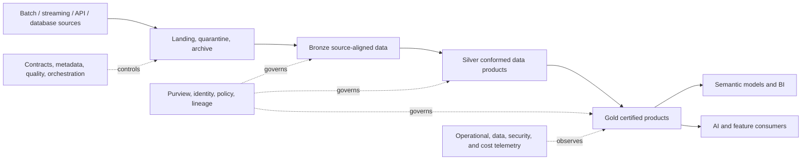

# 11 Enterprise Data Platform Architecture

**Principal Data Engineer architecture and executable reference portfolio**

> This repository is a synthetic, portfolio-grade reference architecture. It does not represent a live enterprise deployment or contain production data.

## Purpose

This project demonstrates how a Principal Data Engineer defines the architecture, operating model, governance, reliability, security, cost controls, and reusable implementation patterns for an enterprise analytical and AI data platform.

The package combines architecture leadership artifacts with a small executable reference pipeline. The implementation proves the metadata, contract, quality, lineage, and Bronze/Silver/Gold patterns without claiming that Azure infrastructure has been deployed.

## Preferred reference architecture

| Capability | Preferred service |
|---|---|
| Lake storage | ADLS Gen2 with Delta Lake |
| Ingestion and orchestration | Azure Data Factory |
| Transformation | Azure Databricks |
| Governed SQL | Synapse Serverless SQL |
| Catalog, classification, and lineage | Microsoft Purview |
| Identity and secrets | Microsoft Entra ID, managed identities, Key Vault |
| Monitoring | Azure Monitor and Log Analytics |
| CI/CD | GitHub Actions |
| Infrastructure as code | Terraform |

Supported alternatives are documented, but the repository uses the choices above as the decisive reference architecture.

## Architecture



See:

- `architecture/logical_architecture.md`
- `architecture/physical_azure_architecture.md`
- `architecture/security_boundaries.md`

## What is executable versus architectural

| Component | Status |
|---|---|
| JSON data-contract validation | Executable local reference |
| Bronze/Silver/Gold sample pipeline | Executable local reference |
| Severity-aware quality gates | Executable local reference |
| Lineage manifest and run metadata | Executable local reference |
| Architecture-document validation | Executable tests and CI |
| Terraform module boundaries | Validation scaffold; no Azure deployment claim |
| Azure Data Factory, Databricks, Purview, Synapse | Target production architecture |
| Multi-region disaster recovery | Documented design; not deployed |

## Executable reference implementation

```bash
python -m venv .venv
source .venv/bin/activate
python -m pip install --upgrade pip
python -m pip install -e reference_implementation

enterprise-platform-demo \
  --config reference_implementation/config/sample_pipeline.json

pytest -q tests reference_implementation/tests
```

The run writes reproducible governance artifacts under `reference_implementation/outputs/sample_run/`:

- Bronze, Silver, and Gold JSON outputs
- Data-quality results
- Source-hash and lineage manifest
- Pipeline-run summary

Generated outputs are ignored by Git.

## Repository structure

```text
architecture/                    Logical, physical, and security architecture
architecture_decision_records/   Platform decisions and revisit triggers
contracts/                       Completed contract examples
cost_management/                 FinOps scorecard and controls
disaster_recovery/               RTO/RPO and recovery strategy
docs/                            Platform architecture, quality, operating model
executive_materials/             Executive summary
infra/terraform/                 Reference module and environment boundaries
interview_narrative/             Principal-level narrative
monitoring_cost/                 Observability and cost-governance framework
reference_implementation/        Executable contract/quality/lineage pipeline
reliability/                     SLIs, SLOs, error budgets
runbooks/                        Completed operational runbook
security_governance/             Security model and access matrix
templates/                       Reusable contract and runbook templates
tests/                           Architecture-document validation
.github/workflows/               CI validation
```

## Principal Data Engineer interview positioning

> I designed a governed enterprise data platform pattern rather than a single pipeline. I selected a decisive Azure reference stack, separated the data and control planes, defined data-product contracts and quality gates, established security and environment boundaries, created measurable reliability and cost controls, and added an executable reference pipeline to prove that the architectural patterns can be implemented consistently.

## Production limitations

- No Azure resources are provisioned by this repository.
- Terraform is intentionally a module-boundary scaffold.
- The local pipeline uses synthetic JSON records and the Python standard library.
- Purview lineage, ADF orchestration, Databricks processing, and multi-region recovery require enterprise implementation and validation.
- Security policies, retention periods, SLOs, and cost thresholds must be approved for the actual organization and regulatory context.
