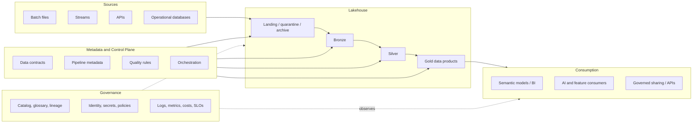

# Logical Architecture

## Design intent

The control plane drives ingestion, contracts, quality, and promotion. The data plane separates source-aligned, conformed, and consumption-ready assets. Governance and observability apply across every layer rather than being downstream add-ons.
