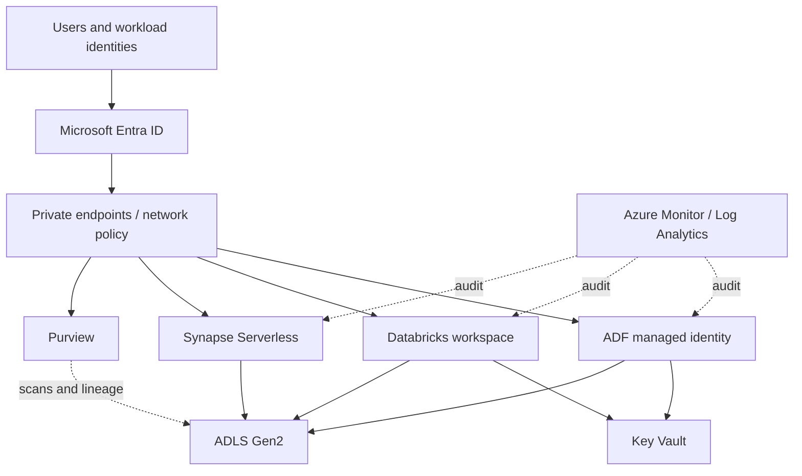

# Security Boundaries

## Required controls

- Least-privilege RBAC and ACLs with quarterly access review.
- Managed identities and workload federation instead of long-lived secrets.
- Private networking and public-network access disabled where practical.
- Encryption at rest and in transit; customer-managed keys for regulated domains when required.
- Row-, column-, and purpose-based controls for sensitive data products.
- Tokenization or irreversible hashing before broad analytical consumption.
- Break-glass access that is time-limited, approved, and fully audited.
- Separation of platform administration, data engineering, stewardship, and security approval duties.
