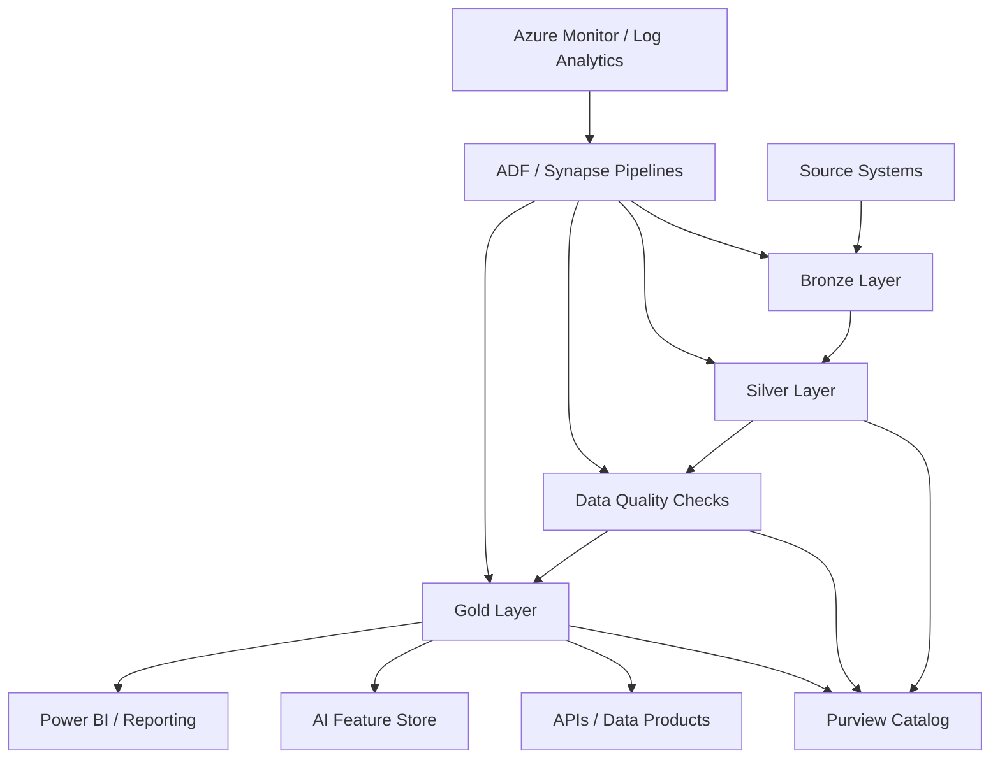

# Lakehouse Architecture Diagram

```mermaid
flowchart TD
    A[Source Systems] --> B[Bronze Layer]
    B --> C[Silver Layer]
    C --> D[Data Quality Checks]
    D --> E[Gold Layer]
    E --> F[Power BI / Reporting]
    E --> G[AI Feature Store]
    E --> H[APIs / Data Products]
    C --> I[Purview Catalog]
    D --> I
    E --> I
    J[ADF / Synapse Pipelines] --> B
    J --> C
    J --> D
    J --> E
    K[Azure Monitor / Log Analytics] --> J
```
